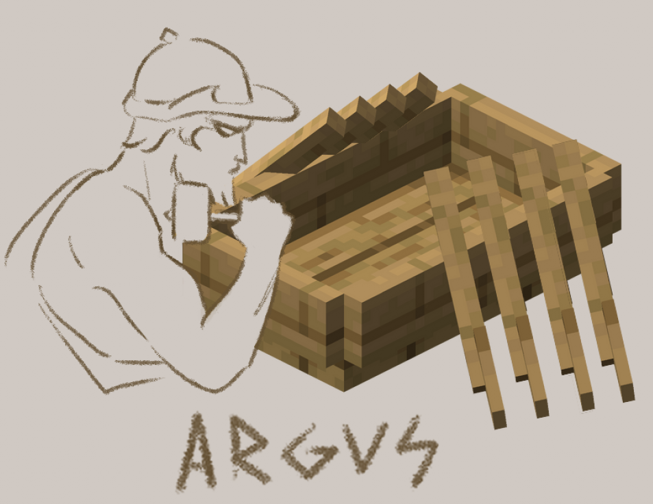

# Argus
<p align="center">
    
    <br>
    <em>Logo designed by Charissa Pacada</em>
</p>

Argus is a custom Minecraft mod for BDI agents to interact with each other in a multi-agent environment. In this environment, the agents act as NPCs with the goal of surviving the zombie attack and collecting as many points as possible. The agents can work together to fight the zombies and/or build houses to hide from them. 

## Beliefs
### External Beliefs (Perceptions)
| Perception | Meaning |
|---|---|
| type(_) | the agent type |
| woodsChopped(_) | the number of woods chopped by the agent |
| buildRequirement(house, _) | the number of woods needed to build a house |
| buildRequirement(sword, _) | the number of woods needed to build a sword |
| buildRequirement(axe, _) | the number of woods needed to build an axe |
| buildRequirement(trident, _) | the number of woods needed to build a trident |
| zombieDefenceLimit(_) | the number of zombies the agent can take on at once |
| allPlayers([_, ..., _]) | the list of current players in the game |
| near(tree) | the agent is near a tree |
| near(zombie, _) | the agent is near zombies (second parameter indicates the count) |
| near(player, [_, ..., _]) | the agent is near player (second parameter indicates the list of players) |
| houseCount(_) | the number of houses available to the player |
| hiding | the agent is hiding in a house |
| health(_) | the agent's current health (between 0 and 1) |
| hasWeapon(_) | the agent has a weapon. Parameter indicates the weapon type |
| damagedBy(_) | the agent took damage from the given entity |

### Internal Beliefs
| Belief | Meaning |
|---|---|
| lowHealthThreshold(_) | the agent considers this a low health |
| searchTimeout(_) | how long the agent should conduct a search for |
| buildRequirement(donation, _) | the agent's donation limit |
| ally(_) | the agent is an ally with the agent |

## Desires
| Desire | Meaning |
|---|---|
| !broadcast(_, _) | send a message of given type and content to all players |
| !sendToGroup(_, _, _) | send a message to a given group of people with a given type and content |
| !loop | the agent's main logic loop |

## Actions
| Action | Meaning |
|---|---|
| say(_) | the agent sends a message to the logs |
| find(_) | find and navigate to a specific parameter (tree, zombie, [player]) |
| chop_wood | the agent chops a tree |
| escape | the agent jumps to a random location |
| attack(_) | the agent attacks a random entity (zombie, [player]) if nearby |
| build(_) | the agent builds an object (house, sword, axe, and trident) |
| enter_house | the agent goes to the house |
| leave_house | the agent leaves the house |
| donate_wood(_) | the agent donates a certain amount of wood |
| receive(_, _) | the agent either receives (wood, count) or (house, from) |

## Messages
| Message | Type | Meaning |
|---|---|---|
| wantAlliance(_) | askIf | the asking agent wants an alliance |
| allianceConfirmation(_) | tell | the agent formed an alliance |
| endAlliance(_) | tell | the agent ends an alliance |
| hasHouse(_) | tell | the agent announces they have a house |
| need(_) | askIf | the asking agent needs something |
| donated(_, _) | tell | the agent donated a number of woods to the agent |

## Installation
1. Get [Minecraft Java Edition](https://www.minecraft.net/en-us/store/minecraft-java-bedrock-edition-pc?tabs=%7B%22details%22%3A0%7D)
2. Install [IntelliJ IDEA](https://www.jetbrains.com/idea/) (recommended!)
3. Install [IntelliJ Mincecraft plugin](https://plugins.jetbrains.com/plugin/8327-minecraft-development)
4. Get [Citizens plugin](https://github.com/CitizensDev/Citizens2/)
5. Get [CommandHelper plugin](https://www.spigotmc.org/resources/commandhelper.64681/)
6. Compile the project to create the `run` folder:
```
gradle runServer
```
7. Configure the server:
```
cp config/server.properties run/server.properties
cp config/eula.txt run/eula.txt
```
8. Copy the plugin jars you downloaded in steps 4 & 5 to `run/plugins`:
```
mv Citizens*.jar commandhelper*.jar run/plugins
```
9. Re-run the server to populate the plugin config folders:
```
gradle runServer
```
10. Configure the plugins:
```
cp config/Citizens/config.yml run/plugins/Citizens/config.yml
cp config/CommandHelper/main.ms run/plugins/CommandHelper/main.ms
```

## Running Argus
1. Launch Minecraft
2. Select `Multiplayer`
3. Create a server for Argus if one does not already exist:
   - Click `Add Server`
   - Put `Argus` for the `Server Name`
   - Put `localhost` for the `Server Address`
   - Click `Done`
4. Launch the server:
```
gradle runServer
```
(Argus should now show up as available in the list of servers)
5. Join the server!

## Using Argus
- The games will by default run for 1.5 minutes. You can see what agent is doing in the chat log and inside your terminal.
- To navigate the level use `WASD`. Use `space` to move the camera up and `shift` to move the camera down.
- If you want to stop the game simply type `/stop` in the Minecraft chat window (you can launch the window by pressing `T` or `/`).

## Running Experiments
- Modify the `main.ms` script under `run/plugins/CommandHelper` with the appropriate setup (alliances of size 1, 2, and 4).
- Run the experiment:
```
./run_experiment.sh
```

## Notes
The name Argus is a nod to the previous major AgentSpeak projects namely, Jason and Peleus. The name Argus  was chosen since this environment allows BDI agents to build weapons and houses!